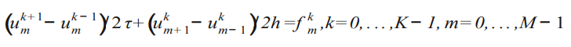
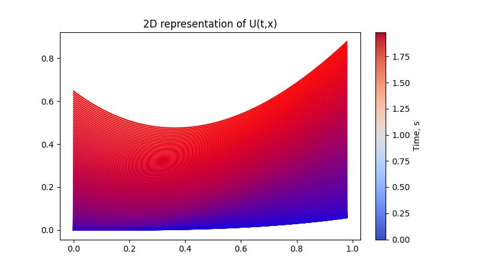

# Convection–diffusion equation

## Methods

To find a solution, you need to use one of the following difference schemes:
1. Angle method
    

    
    
    

2. Four-points method
    

    
    
    

3. Three-points method
    

    
    
    

4. Cross method
    

    
    
    

## Results and Discussion
Given system is:

$$ 
\begin{cases}
u + c \cdot u = t \cdot x,\\
u(0,x) = \frac{x^{3}}{12 \cdot c^{2}},\\
u(t,0) = \frac{t^{3} \cdot c}{12}, \\
c = 1
\end{cases}
$$

#### Analytical solution for this system:
\* Taken from [here](https://ozlib.com/823935/informatika/uravnenie_perenosa).

    
     
    &nbsp; &nbsp; &nbsp; &nbsp; &nbsp; &nbsp; &nbsp; &nbsp; &nbsp; &nbsp; &nbsp; &nbsp;
    <small>Numerical solution of the equation according to the difference scheme: a - when the Courant condition is met; b - with violation of the Courant condition.</small>

#### Numerical solution for the given system

    

    
    &nbsp; &nbsp; &nbsp; &nbsp;
    

